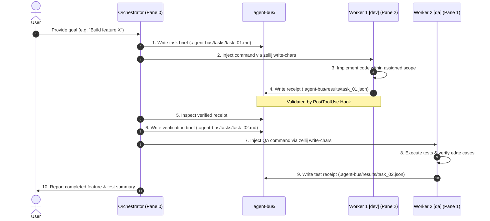

# 🤖 Zellij Mailbox: Multi-Agent Terminal Orchestrator Plugin

A robust, portable multi-agent orchestration plugin for terminal multiplexers ([Zellij](https://zellij.dev/)) powered by Google DeepMind's [Antigravity CLI](https://antigravity.google) (`agy`) and Gemini CLI.

`zellij_mailbox` coordinates specialized autonomous AI agents across dedicated terminal panes using an asynchronous, file-backed messaging bus (`.agent-bus/`), deterministic JSON receipts, progressive skill runbooks, and automated lifecycle hooks.

---

## 🏛️ Architecture Overview

```
                                 LEAD ORCHESTRATOR (Pane 0)
                                 - Goal Decomposition
                                 - Task Dispatch & Oversight
                                 - Governed by SKILL.md
                                             │
                     ┌───────────────────────┴───────────────────────┐
                     │ Writes Task Briefs (.agent-bus/tasks/<id>.md) │
                     │ Injects commands into target worker panes     │
                     ▼                                               ▼
┌────────────────────────────────┐              ┌────────────────────────────────┐
│      Worker 1 (Pane 2)         │              │      Worker 2 (Pane 1)         │
│   Primary Role: dev            │              │   Primary Role: qa             │
│   - Feature Implementation     │              │   - Test Suite Verification    │
│   - Bugfixes & Refactoring     │              │   - Edge-Case Hunting          │
└────────────────┬───────────────┘              └────────────────┬───────────────┘
                 │                                               │
                 └───────────────────────┬───────────────────────┘
                                         │
                                         ▼
                         ┌───────────────────────────────┐
                         │   Receipt Bus (.agent-bus/)   │
                         │   - .agent-bus/results/<id>.json│
                         │   - Validated by Lifecycle    │
                         │     Hooks (hooks.json)        │
                         └───────────────────────────────┘
```

---

## ✨ Key Features

- **📦 Native Antigravity / Gemini CLI Plugin:** Zero collision with target project `GEMINI.md` rules; works seamlessly in any repository.
- **🧭 Progressive Disclosure Skill:** Ingests orchestration runbooks only when needed, preserving precious context tokens.
- **🪝 Automated Lifecycle Hooks (`hooks.json`):**
  - **`Stop` Hook:** Prevents workers from exiting without writing required JSON receipts.
  - **`PostToolUse` Hook:** Validates JSON receipt schema adherence on write.
  - **`PreToolUse` Hook:** Enforces file boundary scope containment and blocks destructive shell commands.
  - **`PreInvocation` Hook:** Injects real-time bus telemetry ephemerally.
- **🧭 Deterministic Identity Protocol:** Overcomes terminal enumeration pitfalls by binding agent identities directly to `$ZELLIJ_PANE_ID`.
- **🎭 Modular Role Catalog:** Hot-swappable agent personas (`dev`, `qa`, `devops`, `reviewer`, `docs`).

---

## 📂 Plugin Structure

```text
.
├── plugin.json                       # Plugin manifest
├── hooks.json                        # Lifecycle automation hooks
├── rules/
│   └── AGENTS.md                     # Scoped dynamic identity binding rules
├── skills/
│   └── zellij-orchestrator/
│       ├── SKILL.md                  # Orchestration runbook & procedures
│       ├── resources/
│           ├── layout.kdl            # Zellij multi-pane template
│           └── roles/                # Modular role specifications
│               ├── _BASE.md          # Universal base receipt protocol
│               ├── dev.md            # Implementation specialist
│               ├── qa.md             # Testing & verification
│               ├── devops.md         # Kubernetes / GKE specialist
│               ├── reviewer.md       # Code review & security audit
│               └── docs.md           # Documentation specialist
│       └── scripts/
│           ├── init_bus.sh           # Scaffolds .agent-bus/ in workspace
│           └── launch.sh             # Zellij session launcher
├── scripts/
│   ├── install.sh                    # Global installer script
│   ├── guardrails.sh                 # PreToolUse safety gate
│   ├── validate_receipt.sh           # PostToolUse receipt validator
│   ├── bus_status.sh                 # PreInvocation status injector
│   └── check_pending_receipt.sh      # Stop hook receipt gate
└── layout.kdl                        # Local Zellij layout configuration
```

---

## 🚀 Quickstart & Installation

Plugins in Gemini CLI and Antigravity (`agy`) are **100% directory-based**—no packaging, bundling, or compilation steps are required.

### 1. Prerequisites
Ensure the target machine has `zellij` and `jq`:

```bash
# macOS
brew install zellij jq

# Linux (Debian / Ubuntu)
sudo apt update && sudo apt install -y jq
# Install Zellij: https://zellij.dev/documentation/installation.html
```

---

### 2. Installing on Another Machine

#### Method A: Clone & Run Installer (Recommended)
This method clones the repository and symlinks it into your global Gemini config. Any future `git pull` automatically updates your global plugin.

```bash
# 1. Clone the repository
git clone https://github.com/guyguy2/zellij_mailbox.git ~/dev/ai-tools/zellij_mailbox

# 2. Run the automated installer
cd ~/dev/ai-tools/zellij_mailbox
./scripts/install.sh
```

**What `install.sh` does:**
- Grants executable permissions to all hook and helper scripts (`chmod +x`).
- Symlinks the plugin to `~/.gemini/config/plugins/zellij-orchestrator`.
- Creates a global `agy-multi` command in `~/.local/bin/agy-multi` (ensure `~/.local/bin` is in your `$PATH`).

#### Method B: Direct Global Clone (One-Liner)
If you don't need a separate development folder and want to install directly to global plugins:

```bash
mkdir -p ~/.gemini/config/plugins ~/.local/bin && \
git clone https://github.com/guyguy2/zellij_mailbox.git ~/.gemini/config/plugins/zellij-orchestrator && \
chmod +x ~/.gemini/config/plugins/zellij-orchestrator/scripts/*.sh \
         ~/.gemini/config/plugins/zellij-orchestrator/skills/zellij-orchestrator/scripts/*.sh && \
ln -sf ~/.gemini/config/plugins/zellij-orchestrator/skills/zellij-orchestrator/scripts/launch.sh ~/.local/bin/agy-multi
```

---

### 3. Launching in Any Workspace

Once installed, you can launch a 3-agent orchestration session from **any** code repository or directory:

```bash
# Navigate to any project
cd ~/path/to/my-project

# Launch multi-agent workspace
agy-multi
```

Or pass an initial prompt/objective directly:
```bash
agy-multi "Implement user authentication with JWT and write tests"
```

Or launch directly with Zellij if running locally from this repository:
```bash
zellij --layout layout.kdl
```

---

### 4. Updating the Plugin

To update the plugin to the latest version:
```bash
cd ~/dev/ai-tools/zellij_mailbox && git pull
```
*(Because it is symlinked to `~/.gemini/config/plugins/zellij-orchestrator`, updates are immediately active across all new sessions).*

---

## 🔄 Multi-Agent Workflow Protocol



---

## 📄 License
MIT License.
