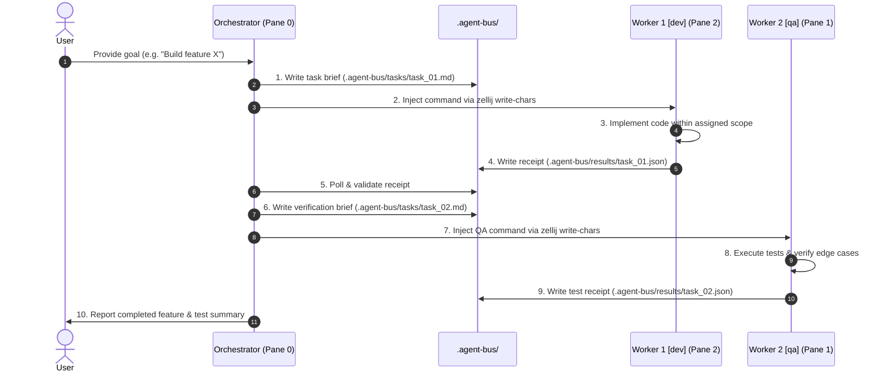

# 🤖 Zellij Mailbox: Multi-Agent Terminal Orchestrator

A lightweight, robust multi-agent orchestration architecture for terminal multiplexers ([Zellij](https://zellij.dev/)) powered by Google DeepMind's [Antigravity CLI](https://antigravity.google) (`agy`).

`zellij_mailbox` coordinates specialized autonomous AI agents across dedicated terminal panes using an asynchronous, file-backed messaging bus (`.agent-bus/`) and deterministic JSON receipts.

---

## 🏛️ Architecture Overview

```
                          ┌────────────────────────────────┐
                          │   Lead Orchestrator (Pane 0)   │
                          │   - Goal Decomposition         │
                          │   - Task Dispatch & Oversight  │
                          └──────────────┬─────────────────┘
                                         │
                 ┌───────────────────────┴───────────────────────┐
                 │ Writes Task Briefs (.agent-bus/tasks/<id>.md) │
                 │ Injects CLI commands into target worker panes │
                 ▼                                               ▼
┌────────────────────────────────┐              ┌────────────────────────────────┐
│      Worker 1 (Pane 2)         │              │      Worker 2 (Pane 1)         │
│   Primary Role: dev            │              │   Primary Role: qa             │
│   - Feature Implementation     │              │   - Test Suite Verification    │
│   - Bugfixes & Refactoring     │              │   - Edge-Case Hunting          │
└────────────────┬───────────────┘              └────────────────┬───────────────┘
                 │                                               │
                 └───────────────────────┬───────────────────────┘
                                         │
                                         ▼
                         ┌───────────────────────────────┐
                         │   Receipt Bus (.agent-bus/)   │
                         │   - .agent-bus/results/<id>.json│
                         │   - Deterministic JSON output │
                         └───────────────────────────────┘
```

---

## ✨ Key Features

- **🧭 Deterministic Identity Protocol:** Overcomes terminal enumeration pitfalls by binding agent identities directly to `$ZELLIJ_PANE_ID` environment variables.
- **📁 File-Based Agent Bus (`.agent-bus/`):** Clean separation of concerns with isolated directories for tasks, receipts, and modular role definitions.
- **🎭 Modular Role Catalog:** Hot-swappable agent personas with strict guardrails and dedicated payload schemas (`dev`, `qa`, `reviewer`, `docs`).
- **⚡ Native Zellij Integration:** Orchestrator controls workers via `zellij action write-chars` and `send-keys`, dynamically renaming panes to reflect live roles.
- **🧾 Structured Receipt Contracts:** Strict JSON completion receipts ensure deterministic validation, transparent error tracking, and seamless pipeline transitions.

---

## 📂 Repository Layout

```text
.
├── GEMINI.md              # Multi-agent role rules & identity protocols
├── layout.kdl             # Zellij multi-pane terminal layout configuration
├── README.md              # Project overview and documentation
└── .agent-bus/
    ├── roles/             # Modular role specifications & payload schemas
    │   ├── _BASE.md       # Universal base protocol & receipt format
    │   ├── dev.md         # Software developer & implementation specialist
    │   ├── qa.md          # QA, testing, & verification specialist
    │   ├── reviewer.md    # Code review, security & architecture auditor
    │   └── docs.md        # Technical writing & documentation specialist
    ├── tasks/             # Task briefs dispatched by the Orchestrator
    └── results/           # JSON completion receipts written by Workers
```

---

## 🚀 Quickstart

### Prerequisites

1. **Zellij**: Install Zellij multiplexer ([Installation Guide](https://zellij.dev/documentation/installation.html)):
   ```bash
   brew install zellij
   ```
2. **Antigravity CLI (`agy`)**: Ensure the `agy` executable is in your `$PATH`.

### Launching the Orchestration Session

Start a session using the provided layout:

```bash
zellij --layout layout.kdl
```

When started:
1. **Pane 0 (`Orchestrator`):** Initializes as the Lead Orchestrator, awaiting your high-level goals.
2. **Pane 2 (`Worker 1`):** Adopts the `dev` specialist role on standby.
3. **Pane 1 (`Worker 2`):** Adopts the `qa` verification specialist role on standby.

---

## 🔄 Multi-Agent Workflow Protocol



---

## 🎭 Role Catalog

| Role | File | Core Responsibilities | Output Deliverables |
| :--- | :--- | :--- | :--- |
| **Universal Base** | [`_BASE.md`](.agent-bus/roles/_BASE.md) | Universal contract, error reporting, isolation guardrails | Standard receipt envelope |
| **Developer** | [`dev.md`](.agent-bus/roles/dev.md) | Feature implementation, refactoring, bugfixes, builds | Code changes, notes for QA |
| **QA Specialist** | [`qa.md`](.agent-bus/roles/qa.md) | Test suite execution, boundary tests, regression checks | Test run metrics, issue list |
| **Code Reviewer** | [`reviewer.md`](.agent-bus/roles/reviewer.md) | Diff inspection, OWASP security audit, complexity analysis | Review findings, score, approval |
| **Documentation** | [`docs.md`](.agent-bus/roles/docs.md) | API references, docstrings, user guides, README updates | Docs created, updated endpoints |

---

## 🧾 JSON Receipt Contract

Every worker outputs a standardized completion receipt to `.agent-bus/results/<task_id>.json`:

```json
{
  "taskId": "task_01_feature_login",
  "role": "dev",
  "workerPaneId": "2",
  "timestamp": "2026-08-15T14:30:00Z",
  "status": "COMPLETED",
  "summary": "Implemented JWT authentication service with refresh token rotation.",
  "filesCreated": ["src/auth/jwt.py"],
  "filesModified": ["src/auth/service.py"],
  "errorsOrWarnings": [],
  "payload": {
    "notesForQA": "Verify token expiration edge case and invalid bearer header.",
    "dependenciesAdded": ["pyjwt>=2.8.0"],
    "breakingChanges": [],
    "verificationCommandRun": "pytest tests/unit/test_jwt.py"
  }
}
```

---

## 🛠️ Orchestrator Command Cheatsheet

### Dispatch Task to Worker
```bash
zellij action rename-pane --pane-id <PANE_ID> "Worker <N> (<role>)" && \
zellij action write-chars --pane-id <PANE_ID> "Adopt role defined in .agent-bus/roles/<role>.md. Execute instructions in .agent-bus/tasks/<task_id>.md and write summary to .agent-bus/results/<task_id>.json" && \
zellij action send-keys --pane-id <PANE_ID> "Enter"
```

### Inspect Worker Telemetry
```bash
zellij action dump-screen -p <PANE_ID>
```

---

## 🔮 Future Enhancements

- **Global vs. Project Agent Bus:** Hybrid model supporting global role catalogs (`~/.agent-bus/roles/`) with repository-level task overrides.
- **Antigravity Skill Packaging (`zellij-orchestrator`):** Packaging layout and scripts into a portable `agy-multi` skill launcher.
- **Dynamic Worker Scaling:** Autonomously spawn new Zellij worker panes on high-volume pipelines.

---

## 📄 License

MIT License.
