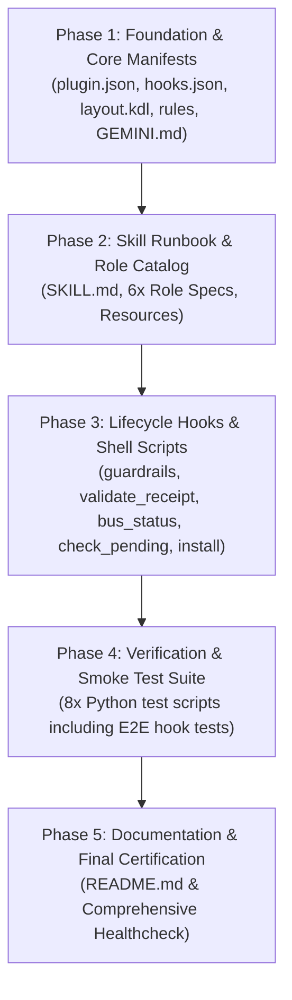

# 🚀 Zellij Orchestrator: Phased Reconstruction Pipeline

This directory contains the complete, production-grade reconstruction prompts for building the **`zellij-orchestrator`** plugin repository from scratch in 5 sequential, deterministic phases.

Each phase is designed as a standalone prompt that can be provided directly to an AI coding assistant (such as Antigravity CLI `agy`, Gemini CLI, Claude Code, Cursor, or Codex) on any target machine.

---

## 📋 Phase Roadmap & Dependency Chain



---

## 📂 Phase Breakdown

| Phase | Prompt File | Scope & Deliverables | Verification Gate |
| :--- | :--- | :--- | :--- |
| **01** | [`01_foundation_manifests_rules.md`](01_foundation_manifests_rules.md) | `plugin.json`, `hooks.json`, `layout.kdl`, `.gitignore`, `rules/AGENTS.md`, `GEMINI.md` | `jq` validation & rule check |
| **02** | [`02_skill_and_role_catalog.md`](02_skill_and_role_catalog.md) | `skills/zellij-orchestrator/SKILL.md`, `resources/layout.kdl`, `resources/roles/` (`_BASE`, `dev`, `qa`, `devops`, `reviewer`, `docs`) | Schema & role contract audit |
| **03** | [`03_hooks_and_shell_scripts.md`](03_hooks_and_shell_scripts.md) | `scripts/*.sh` (guardrails, validate_receipt, bus_status, check_pending_receipt, install), `skills/.../scripts/*.sh` (init_bus, launch) | Syntax check (`bash -n`) & execution permissions |
| **04** | [`04_verification_test_suite.md`](04_verification_test_suite.md) | `tests/` (worker_hook_smoke, dev_check, test_qa_check, autowake_check, e2e_hook_test, worker1_math, worker2_anagram, worker2_string) | Full pytest/python3 test execution |
| **05** | [`05_documentation_and_packaging.md`](05_documentation_and_packaging.md) | `README.md`, end-to-end multi-agent verification, installer smoke test | Complete repo integrity pass |

---

## 🛠️ How to Execute on a Target Machine

1. **Create an empty workspace directory:**
   ```bash
   mkdir -p zellij_mailbox && cd zellij_mailbox
   git init
   ```

2. **Execute Phase by Phase:**
   Feed each phase prompt sequentially to your AI coding agent:
   - Provide the contents of [`01_foundation_manifests_rules.md`](01_foundation_manifests_rules.md)
   - Once Phase 1 completes and verifies, provide [`02_skill_and_role_catalog.md`](02_skill_and_role_catalog.md)
   - Continue with [`03_hooks_and_shell_scripts.md`](03_hooks_and_shell_scripts.md)
   - Continue with [`04_verification_test_suite.md`](04_verification_test_suite.md)
   - Complete with [`05_documentation_and_packaging.md`](05_documentation_and_packaging.md)

3. **Run Final Verification:**
   ```bash
   chmod +x scripts/*.sh skills/zellij-orchestrator/scripts/*.sh
   python3 tests/e2e_hook_test.py
   ```
