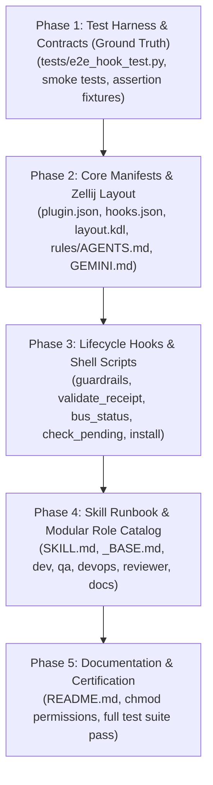

# 🧪 Zellij Orchestrator: TDD Phased Reconstruction Pipeline

This directory contains the concise, **Test-Driven Development (TDD) and contract-based reconstruction prompts** for building the **`zellij-orchestrator`** plugin repository from scratch.

Unlike verbatim code dumps, this pipeline leverages AI reasoning and autonomous verification loops:
1. **Tests & Contracts First:** Defines the test harness (`tests/e2e_hook_test.py`) and JSON schemas upfront.
2. **Behavioral Implementation:** Prompts describe functional specifications, allowing the LLM to write idiomatic code.
3. **Iterative Verification Gate:** Directs the AI coding assistant to run tests, inspect failures, and ensure green builds before advancing.

---

## 📋 TDD Phase Roadmap

---

## 📂 Phase Breakdown

| Phase | Prompt File | Focus & Deliverables | Verification Gate |
| :--- | :--- | :--- | :--- |
| **01** | [`01_test_harness_and_contracts.md`](01_test_harness_and_contracts.md) | `tests/e2e_hook_test.py` and 7 worker test fixtures | `python3 -m py_compile tests/*.py` |
| **02** | [`02_manifests_and_layout.md`](02_manifests_and_layout.md) | `plugin.json`, `hooks.json`, `layout.kdl`, `rules/AGENTS.md`, `GEMINI.md`, `.gitignore` | `jq` validation & rule check |
| **03** | [`03_hooks_and_shell_scripts.md`](03_hooks_and_shell_scripts.md) | `scripts/*.sh` (guardrails, validate_receipt, bus_status, check_pending, install), skill scripts | `python3 tests/e2e_hook_test.py` (100% PASS) |
| **04** | [`04_skill_and_role_catalog.md`](04_skill_and_role_catalog.md) | `skills/zellij-orchestrator/SKILL.md`, `resources/roles/` (`_BASE`, `dev`, `qa`, `devops`, `reviewer`, `docs`) | Schema & role contract audit |
| **05** | [`05_documentation_and_certification.md`](05_documentation_and_certification.md) | `README.md`, full test suite execution, installer certification | Full repository green pass |

---

## 🚀 Master Single-Prompt Option

If you prefer to feed a single prompt to an AI assistant rather than 5 sequential phases, use:
- [`../TDD_RECONSTRUCTION_PROMPT.md`](../TDD_RECONSTRUCTION_PROMPT.md)
